A sample illustration of [Github](https://github.com/) code repo integration with OCI Devops.

--------

#### Objectives

- Create a sample repo and personal access token via Github.
- Create vault ,policies as accordingly.
- Create a devops connection and integrate with OCI.
- Test and validate the integrations.

#### Procedure 

- Follow Github documentation and do a sign in. - http://github.com 
- Create a Github  repo (it can be public or private)  - https://docs.github.com/en/get-started/quickstart/create-a-repo


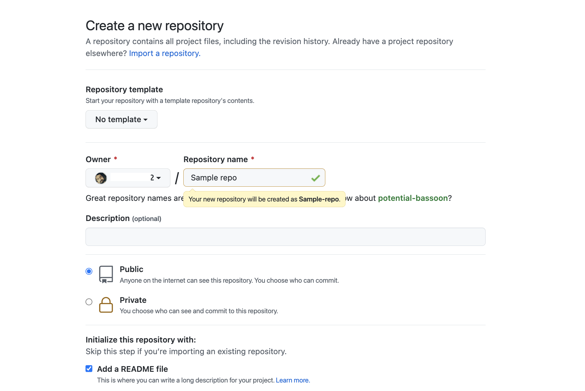

- Click on the Gitlab profile icon  and select `Settings` option.


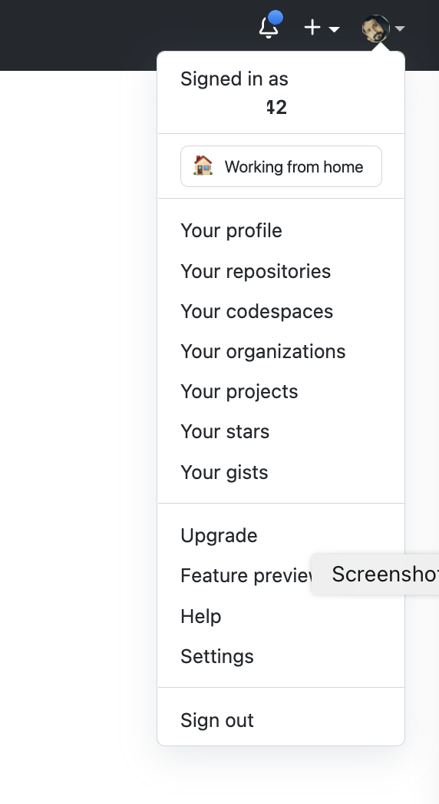

- Click `Developer Settings`


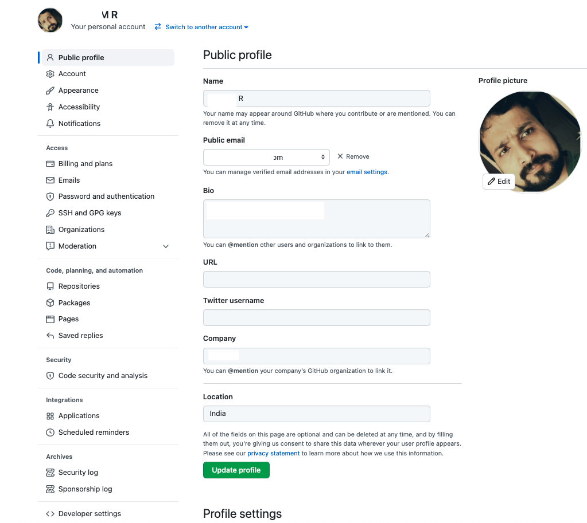

- Click `Personal Access Token` > `Generate Token`


- Provide a name and select one of the below scope .

    - `repo` ( Full control of private repositories) for private and public repo access.
    - `public_repo` (For public repo access only). 

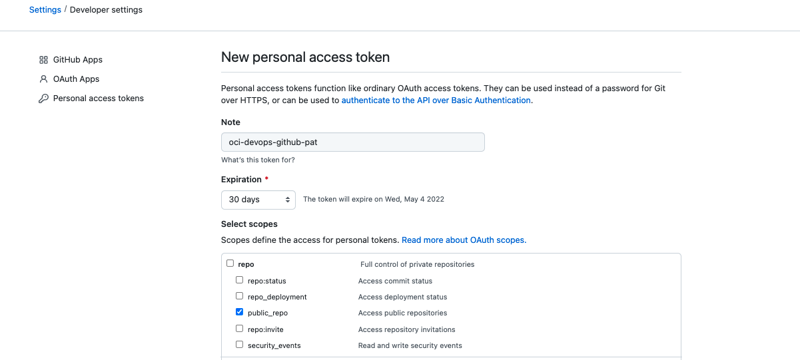

- Please make a note of the newly generated token.

- In order to security store and orchestrate Gitlab Personal Access toekn , we will create a new OCI Vult for now .

-  Create a new vault under the concerned compartment. - https://docs.oracle.com/en-us/iaas/Content/KeyManagement/Concepts/keyoverview.htm#Overview_of_Vault 


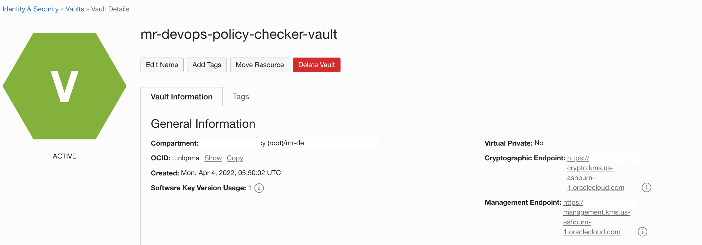

- Create a new `Encryption Key`.


- Create a new secrets and store the Github - PAT.

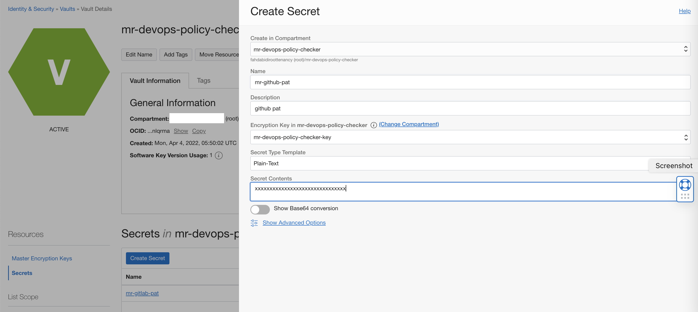

- Create a `Dynamic group` with below rules .

```
ALL {resource.type = 'devopsconnection', resource.compartment.id = 'ocid1.compartment.oc1..xxxxx'}
```

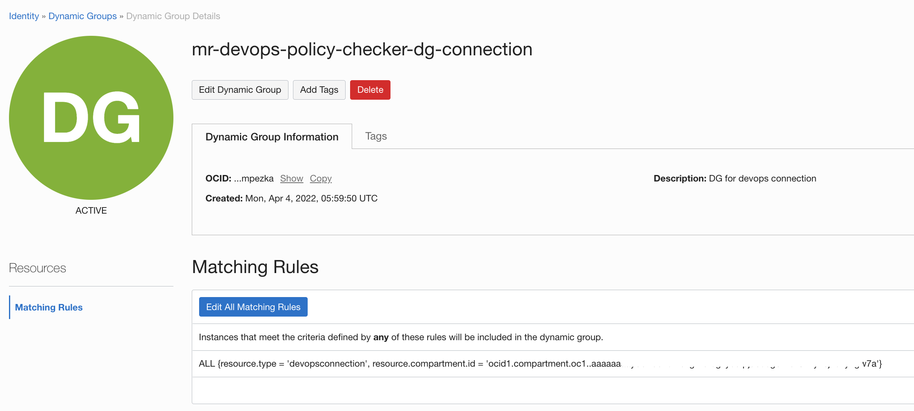


- Create a policy (Ensure to create it under the **ROOT of tenancy**) for the dynamic groups with below policy statement.

```
Allow dynamic-group mr-devops-policy-checker-dg-connection to read secret-family in compartment <compartment name>

```


- Create a notification topic ,that will be used for devops - https://docs.oracle.com/en-us/iaas/Content/Notification/Tasks/managingtopicsandsubscriptions.htm#createTopic


- Create a devops project - https://docs.oracle.com/en-us/iaas/Content/devops/using/create_project.htm#create_a_project

- Ensure to associate it with a `notification topic`.

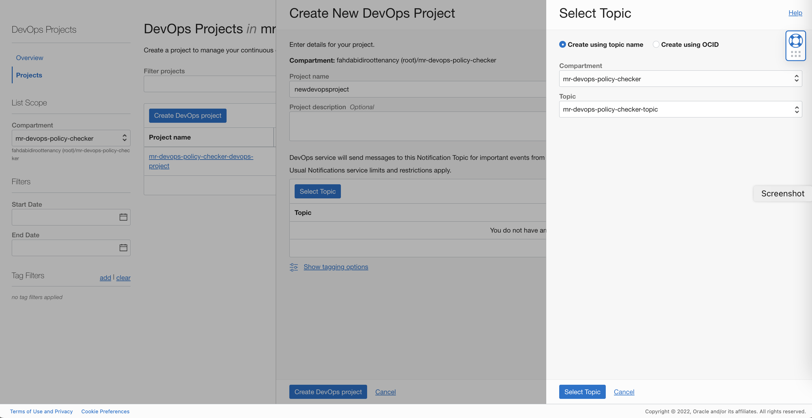

- Under the project click `Enable Logging` and `toggle`  and enable the logs.


- Select the logging details and enable .

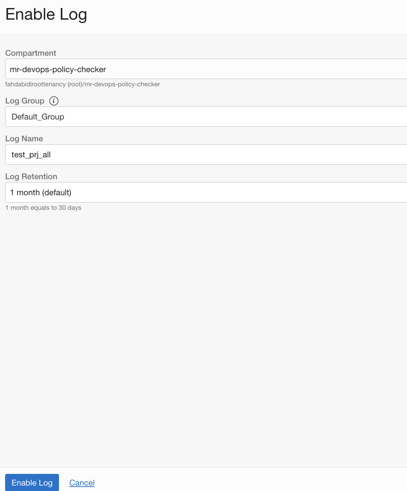


- Create a new  `external connection` - https://docs.oracle.com/en-us/iaas/Content/devops/using/create_connection.htm

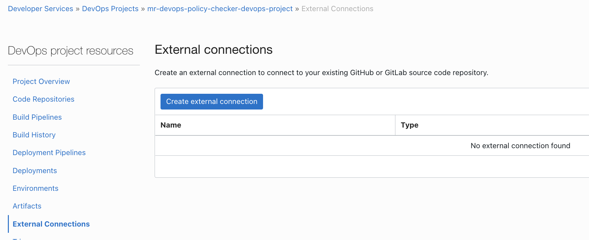

 - Select the type as `Github`  and associate with the Vault and secret created.


 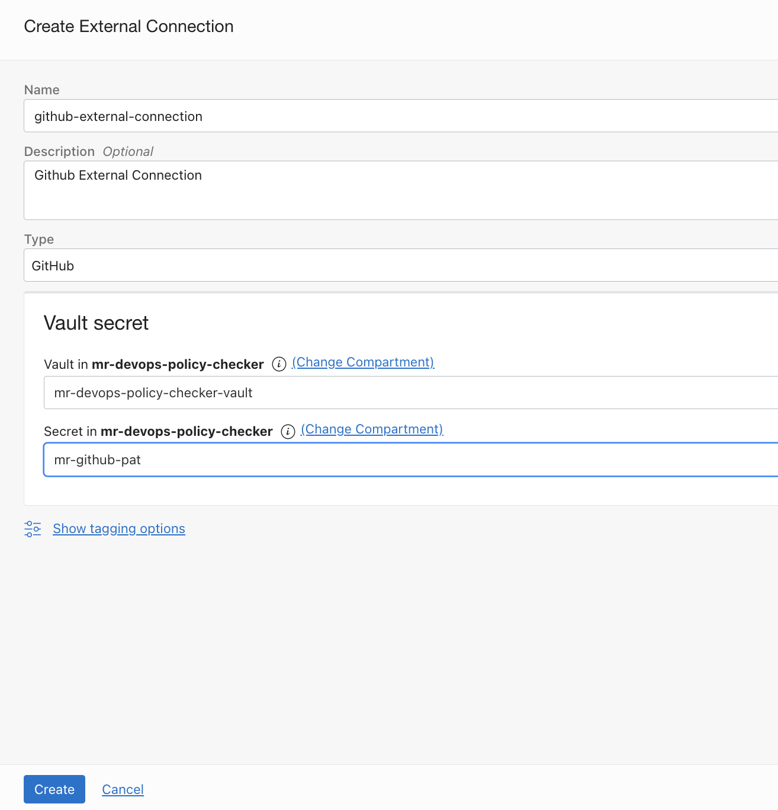


- Use devops `Code Repositories` and mirror gitlab to oci devops. - https://docs.oracle.com/en-us/iaas/Content/devops/using/mirror_repo.htm 


- Select the external connection created and select the Gitlab repository. You may mention a custom name (as optional) which will be used when the external repo is cloned to OCI Code repo.

- You may alter the Scheduling type to a custom value if needed .The default sync is `15 minutes`.


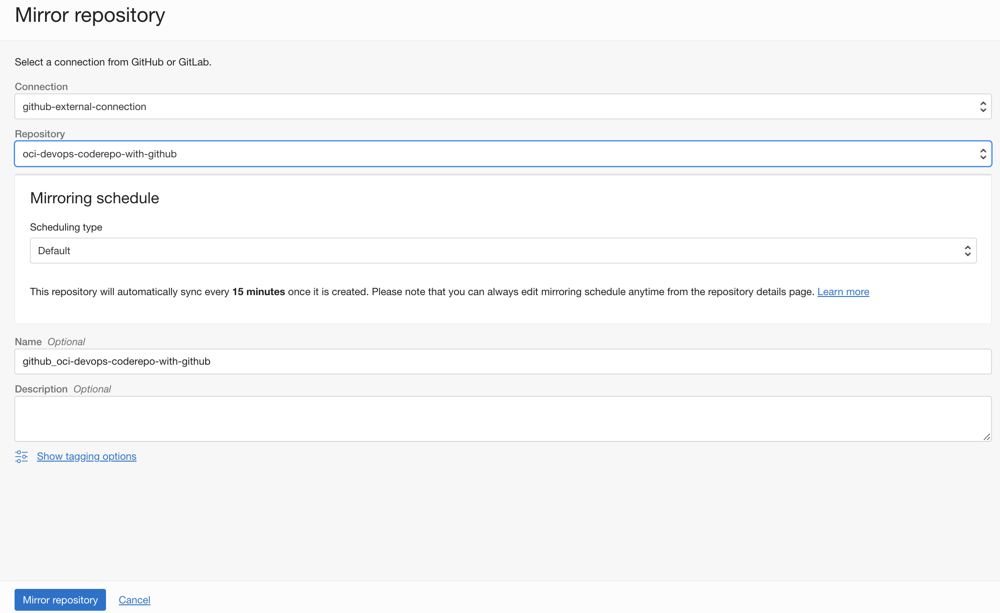

- After a while the repo will be available via `OCI Code Repo`


- You may use the options and `Re synchronize` if needed.

